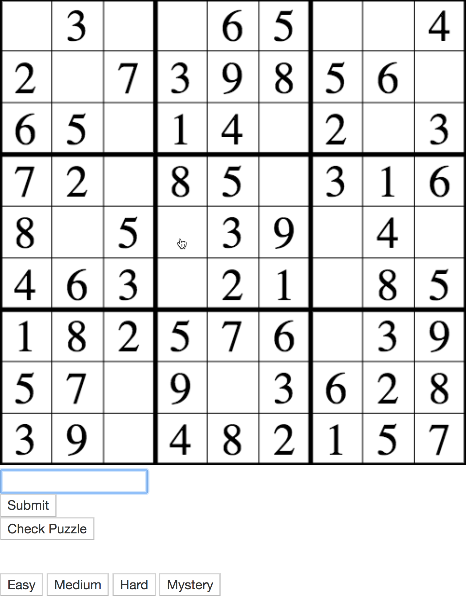
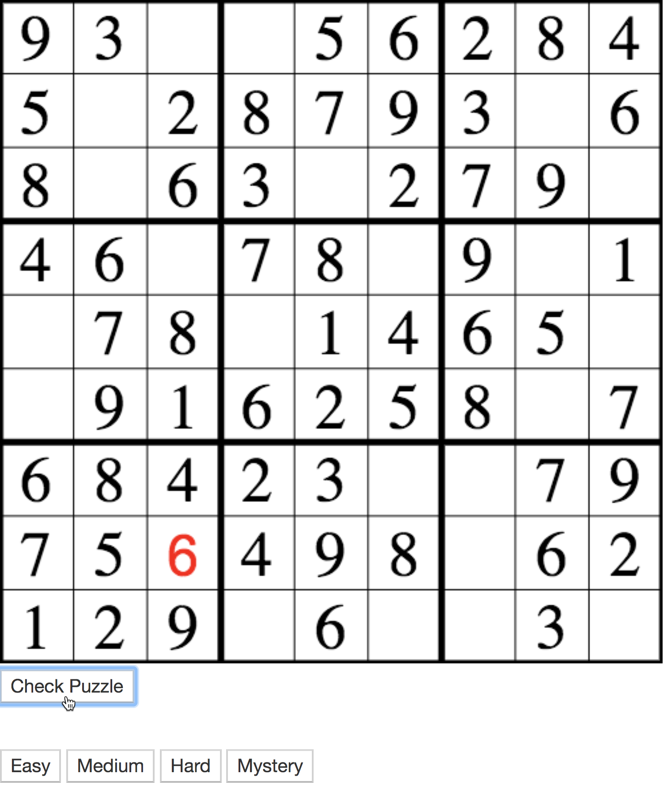
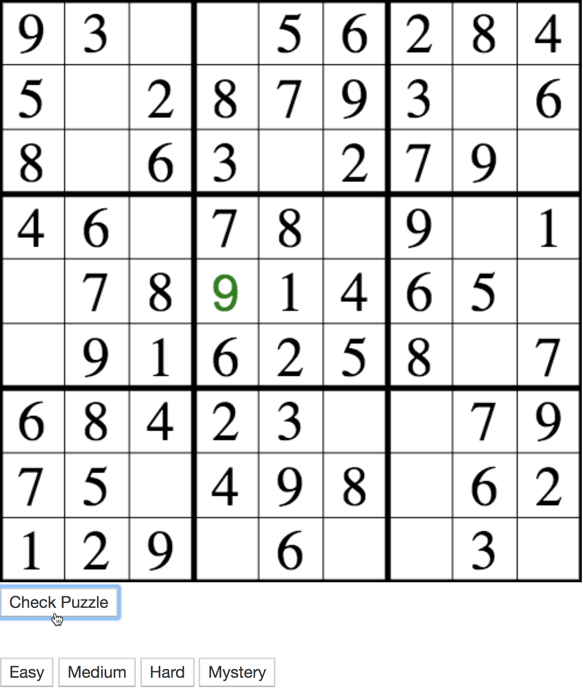

# Sudoku

Sudoku is a SPA that generates original Sudoku boards for users to play and rank their performance. Written with 
vanilla JavaScript and focused on a central canvas, where the board graphics are drawn. A rails API generates the 
board numbers/sequence with an original algorithm, and then exposes the boards to the front end to populate the
main canvas.

## Getting Started

Our rail API is set up for PostgreSQL, so make sure to download and start a server before starting the app
locally!

### Installing

clone both front and back end repos.

back end:

$ bundle install
$ rake db:create
$ rake db:migrate
$ rake db:seed
$ rails s

front end:
copy the absolute path of index.html into your browser

## Built With

* [JavaScript ES6](https://developer.mozilla.org/en-US/docs/Web/JavaScript) - frontend language
* [Ruby on Rails](https://guides.rubyonrails.org/) - backend API
* [PostgreSQL](https://www.postgresql.org/docs/) - databases

## Screen Caps:
### Click an empty square to open the number input field.

### Checking will change color to red if submission is wrong...

### ...and green if submission is right!

